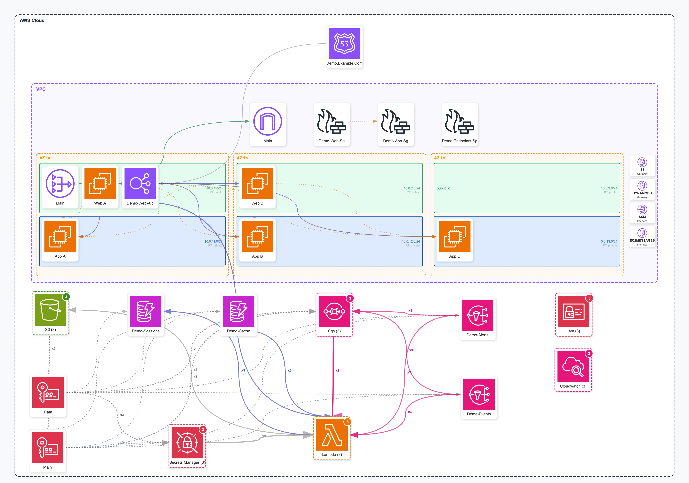

# terraformgraph

Generate interactive architecture diagrams from your Terraform configurations. Supports AWS resources with automatic service grouping, relationship detection, and beautiful SVG/HTML output.



## Features

- **Automatic parsing** of Terraform HCL files with state integration
- **Smart resource grouping** into logical services (ECS, RDS, S3, etc.)
- **Relationship detection** based on resource references
- **VPC structure visualization** with subnets and availability zones
- **VPC endpoint visualization** with service-specific icons (S3, DynamoDB, ECR, etc.)
- **Accurate resource positioning** using Terraform state
- **Interactive HTML output** with:
  - Drag-and-drop repositioning of service icons
  - Click-to-highlight connections between services
  - Click-to-highlight source and target endpoints
  - Save/Load layout persistence
  - Zoom and pan navigation
- **PNG/JPG export** directly from the browser
- **Customizable** via YAML configuration files
- **No cloud credentials required** - works entirely offline

## Prerequisites

### Required

- **Python 3.9+** (3.9, 3.10, 3.11, or 3.12)
- **pip** (Python package manager)
- **Terraform CLI** - Required for generating state JSON

### Optional

- **AWS Architecture Icons** - For beautiful service icons (see [With AWS Icons](#with-aws-icons))

### Terraform Setup

Before using terraformgraph, initialize and apply your Terraform configuration:

```bash
cd ./infrastructure
terraform init
terraform apply   # or terraform plan for undeployed infrastructure
```

This creates the state data that terraformgraph uses for accurate diagram generation.

## Installation

### From PyPI

```bash
pip install terraformgraph
```

### From Source

```bash
git clone https://github.com/ferdinandobons/terraformgraph.git
cd terraformgraph
pip install -e .
```

### Development Installation

For contributing or running tests:

```bash
git clone https://github.com/ferdinandobons/terraformgraph.git
cd terraformgraph
pip install -e ".[dev]"
```

This installs additional development dependencies:
- `pytest` - Testing framework
- `pytest-cov` - Code coverage
- `black` - Code formatting
- `ruff` - Linting
- `mypy` - Type checking

## Quick Start

### Basic Usage

Generate a diagram from a Terraform directory:

```bash
terraformgraph -t ./infrastructure
```

This creates `terraformgraph.html` in the current directory.

**Note:** The tool automatically generates state JSON from `terraform show -json` if no cached state exists. Make sure your Terraform is initialized (`terraform init`) before running.

### With Environment Subdirectories

If your Terraform is organized by environment:

```bash
terraformgraph -t ./infrastructure -e prod -o prod-diagram.html
```

### With Pre-generated State File

If you want to generate the state file manually (useful for CI/CD):

```bash
# Generate state JSON
cd ./infrastructure
terraform show -json > state.json

# Use it with terraformgraph
terraformgraph -t ./infrastructure --state-file state.json
```

### Force State Refresh

To regenerate the cached state file:

```bash
terraformgraph -t ./infrastructure --refresh-state
```

### With AWS Icons

For beautiful AWS service icons, download the [AWS Architecture Icons](https://aws.amazon.com/architecture/icons/) and extract them:

```bash
terraformgraph -t ./infrastructure -i ./AWS_Icons
```

The tool also auto-discovers icons in these locations:
- `./aws-official-icons`
- `~/aws-official-icons`
- `~/.terraformgraph/icons`

## Command Line Options

| Option | Short | Required | Description |
|--------|-------|----------|-------------|
| `--terraform` | `-t` | Yes | Path to Terraform directory |
| `--environment` | `-e` | No | Environment subdirectory (dev, staging, prod) |
| `--icons` | `-i` | No | Path to AWS icons directory |
| `--output` | `-o` | No | Output HTML file path (default: `terraformgraph.html`) |
| `--verbose` | `-v` | No | Enable debug output |
| `--state-file` | `-s` | No | Path to pre-generated state JSON file |
| `--refresh-state` | | No | Force regeneration of cached state file |

### Examples

```bash
# Basic usage (auto-generates state)
terraformgraph -t ./infrastructure

# With environment
terraformgraph -t ./infrastructure -e prod

# With custom output
terraformgraph -t ./infrastructure -o my-diagram.html

# With AWS icons
terraformgraph -t ./infrastructure -i ~/Downloads/AWS_Icons

# With pre-generated state file
terraformgraph -t ./infrastructure -s state.json

# Force state refresh
terraformgraph -t ./infrastructure --refresh-state

# Full options with verbose output
terraformgraph -t ./infrastructure -e prod -i ./icons -o prod.html -v
```

## How It Works

1. **State Acquisition**: terraformgraph reads Terraform state (from cached file, provided file, or auto-generated via `terraform show -json`)
2. **HCL Parsing**: Parses `.tf` files to understand resource structure and relationships
3. **Resource Aggregation**: Groups resources into logical services (e.g., all ECS-related resources into an "ECS" service)
4. **VPC Structure**: Builds VPC topology with availability zones, subnets, and endpoints
5. **Layout Computation**: Calculates optimal positions for services in the diagram
6. **HTML Generation**: Creates interactive SVG diagram with pan, zoom, and drag capabilities

## Configuration

### Custom Aggregation Rules

Create `~/.terraformgraph/aggregation_rules.yaml` to customize how resources are grouped:

```yaml
compute:
  my_custom_service:
    primary: ["aws_my_resource"]
    secondary: ["aws_my_helper"]
    in_vpc: true
```

### Custom Connections

Create `~/.terraformgraph/logical_connections.yaml` to define service relationships:

```yaml
connections:
  - source: my_service
    target: another_service
    label: "Custom Connection"
    type: data_flow
```

## Supported Resources

The tool supports 100+ AWS resource types including:

### Compute
- ECS (Clusters, Services, Task Definitions)
- EC2 (Instances, Auto Scaling Groups, Launch Templates)
- Lambda (Functions, Layers, Event Source Mappings)
- EKS (Clusters, Node Groups)
- Batch (Compute Environments, Job Queues)

### Networking
- VPC (VPCs, Subnets, Route Tables, Internet Gateways)
- VPC Endpoints (Gateway and Interface types)
- Load Balancers (ALB, NLB, Target Groups)
- Route53 (Zones, Records)
- CloudFront (Distributions)
- API Gateway (REST and HTTP APIs)

### Storage
- S3 (Buckets, Bucket Policies)
- EBS (Volumes, Snapshots)
- EFS (File Systems, Mount Targets)

### Database
- RDS (Instances, Clusters, Parameter Groups)
- DynamoDB (Tables, Global Tables)
- ElastiCache (Clusters, Replication Groups)
- DocumentDB, Neptune, Redshift

### Messaging & Integration
- SQS (Queues)
- SNS (Topics, Subscriptions)
- EventBridge (Rules, Event Buses)
- Step Functions (State Machines)
- Kinesis (Streams, Firehose)

### Security
- IAM (Roles, Policies, Users, Groups)
- KMS (Keys, Aliases)
- Secrets Manager (Secrets)
- WAF (Web ACLs, Rules)
- Security Groups

### Monitoring & Management
- CloudWatch (Alarms, Log Groups, Dashboards)
- CloudTrail
- Config Rules

### And many more...

See the full list in the [aggregation_rules.yaml](terraformgraph/config/aggregation_rules.yaml) configuration file.

## Output

The generated HTML file includes:

### Interactive Features
- **Pan and Zoom** - Navigate large diagrams easily
- **Drag-and-drop** - Reposition service icons within their containers
- **Click connections** - Click any connection line to highlight the data flow
- **Click services** - Click any service to see all its connections highlighted
- **Save layout** - Persist your custom icon positions to browser storage
- **Load layout** - Restore previously saved positions

### Export Options
- **PNG Export** - High-quality raster image
- **JPG Export** - Compressed raster image

### Visual Elements
- **VPC containers** with subnet boundaries
- **Availability zone indicators**
- **Service icons** (with AWS icons or colored fallbacks)
- **Connection lines** showing relationships
- **Resource counts** for grouped resources
- **Legend** with interaction instructions

## Project Structure

```
terraformgraph/
├── terraformgraph/
│   ├── __init__.py          # Package init with version
│   ├── __main__.py          # Entry point for python -m
│   ├── main.py              # CLI entry point
│   ├── parser.py            # Terraform HCL parser
│   ├── aggregator.py        # Resource grouping logic
│   ├── layout.py            # Diagram layout engine
│   ├── renderer.py          # SVG/HTML renderer
│   ├── icons.py             # AWS icon mapper
│   ├── terraform_tools.py   # Terraform CLI integration
│   ├── variable_resolver.py # Variable resolution
│   └── config/              # Default configuration files
├── tests/                   # Test suite
├── example/                 # Example Terraform configs
└── docs/                    # Documentation
```

## Running Tests

```bash
# Run all tests
pytest

# Run with coverage
pytest --cov=terraformgraph

# Run specific test file
pytest tests/test_parser.py

# Run with verbose output
pytest -v
```

## Contributing

Contributions are welcome! Please see [CONTRIBUTING.md](CONTRIBUTING.md) for guidelines.

### Development Workflow

1. Fork the repository
2. Create a feature branch
3. Make your changes
4. Run tests: `pytest`
5. Format code: `black terraformgraph/`
6. Lint code: `ruff check terraformgraph/`
7. Submit a pull request

## Changelog

See [CHANGELOG.md](CHANGELOG.md) for version history and changes.

## License

MIT License - see [LICENSE](LICENSE) for details.

## Author

Ferdinando Bonsegna - [GitHub](https://github.com/ferdinandobons)
